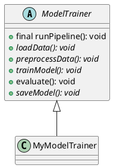

# Template Method — ML pipeline 

When you need a fixed sequence of steps for clients (for example a CI/CD or ML training pipeline), use the Template Method pattern. Define an abstract base class that provides a final (non-overridable) template method which calls a sequence of steps. Subclasses implement the variable steps.

## Concept
- Template method (final): defines the fixed sequence.
- Primitive operations (abstract/protected): implemented by subclasses.
- Optional hook methods: provide default implementations that subclasses may override.

## Example (Java-like pseudocode)
```java
abstract class ModelTrainer {
    // Template method: fixed sequence, cannot be overridden
    public final void runPipeline() {
        loadData();
        preprocessData();
        trainModel();
        evaluate();
        saveModel();
    }

    protected abstract void loadData();
    protected abstract void preprocessData();
    protected abstract void trainModel();
    protected abstract void saveModel();

    // optional hook with default behavior
    protected void evaluate() {
        // default evaluation; subclasses may override
    }
}

class MyModelTrainer extends ModelTrainer {
    protected void loadData() { /* ... */ }
    protected void preprocessData() { /* ... */ }
    protected void trainModel() { /* ... */ }
    protected void saveModel() { /* ... */ }
    protected void evaluate() { /* custom eval */ }
}
```

Clients always call `runPipeline()` so the sequence is guaranteed.

## UML (PlantUML)
Paste this into a PlantUML editor to render the class diagram.


Notes:
- Mark the template method as final in languages that support it (Java `final`, C++ `final`, or avoid overriding by convention).
- Use protected/abstract for steps that must be provided by each model.
- Hooks (like `evaluate`) let you provide defaults without breaking the fixed sequence.

```
template method design skeletion of an algo, for an operation defining some steps to subclasses. Template method let subclass redefine certain step of an algo without changing algo structure.
```